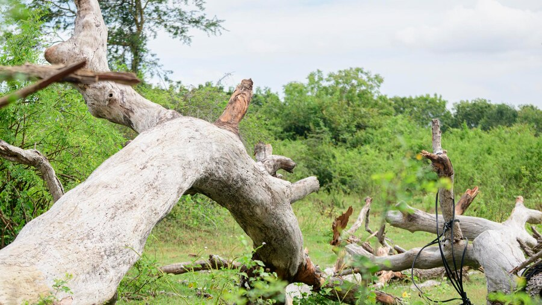
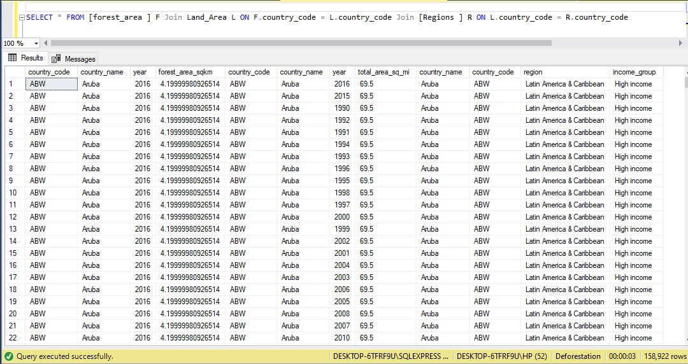
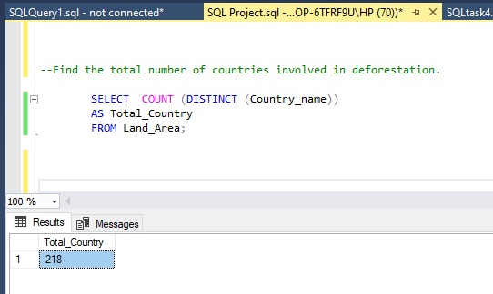
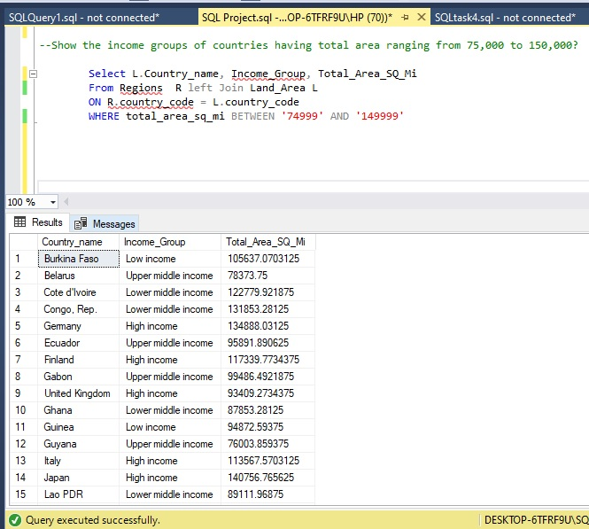
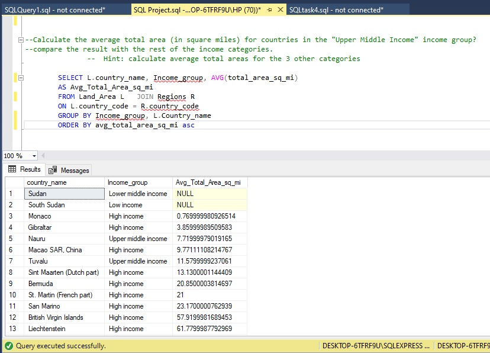
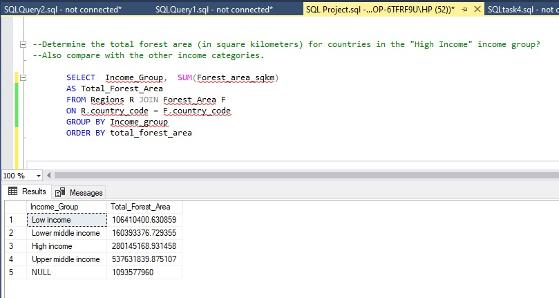
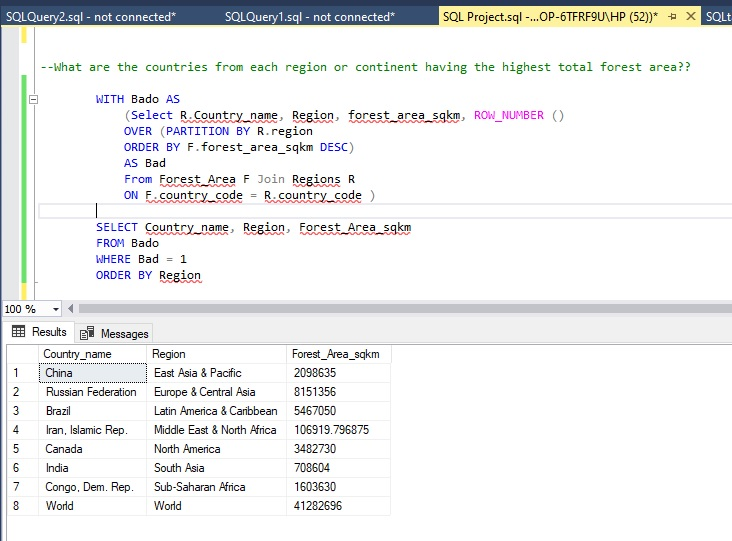

# ANALYSIS-OF-DEFORESTATION-ON-GLOBAL-FOREST
2016 Data and Analysis to Reveal the Trends in Global Deforestation.

## Introduction
This repository serves as a pivotal hub for data-driven insights focused intently on the intricate dynamics and repercussions of global deforestation. I embarked on a comprehensive exploration into deforestation, recognizing it as one of the most paramount environmental challenges of our era. Through this data analysis, I delve deep into the nuances of deforestation, dissecting its patterns across nations, various income classifications, and regional landscapes. My primary goal is to illuminate the multifaceted dynamics of deforestation and derive actionable insights by addressing key questions

## Dataset 
The dataset for this analysis is the 2016 global deforestation dataset thoughtfully curated by our instructor. This dataset is an invaluable resource composed of three distinct files, each formatted as comma-separated values (CSV). The files, namely "Forest Area," "Land Area," and "Region," provide a comprehensive snapshot of the intricate landscape of deforestation on a global scale.  Using the below syntax I was able to join the three dataset together to have a better understanding of the dataset. 

SELECT * FROM [forest_area ] F Join Land_Area L ON F.country_code = L.country_code Join [Regions ] R ON L.country_code = R.country_code

## Data Analysis 
By exploring all relevant variables available in the dataset, several business questions were answered to better understand and optimize and gain insight. Here are a few such questions:
-	Find the total number of countries involved in deforestation. 
-	Show the income groups of countries having total area ranging from 75,000 to 150,000?
-	Calculate the average total area (in square miles) for countries in the "Upper Middle Income" income group?  Compare the result with the rest of the income categories.
-	Determine the total forest area (in square kilometers) for countries in the "High Income" income group? Also compare with the other income categories. 
-	What are the countries from each region or continent having the highest total forest area?? 

The first cornerstone of my analysis involved the creation of a dedicated database aptly named "Deforestation." This serves as the bedrock upon which i unravel the intricate narratives within the provided datasets.  And the three crucial datasets – "Forest Area," "Land Area," and "Region"   were meticulously imported. These CSV files, brimming with valuable information, are the building blocks of my analysis. 

#### FIND THE TOTAL NUMBER OF COUNTRIES INVOLVED IN DEFORESTATION.
  
Kicking off my analytical expedition, the first task was to ascertain the total number of countries entangled in the pressing issue of deforestation. Utilizing the COUNT along with the DISTINCT operator was an insightful approach to accumulate the count of countries across the dataset. The screenshot displays both the SQL syntax I employed and the result after the execution of the syntax.

Insight Derived:
 
This numerical insight serves as an anchor, grounding us in the reality that a significant portion of nations is intricately involved in the phenomenon of deforestation. The magnitude of 218 countries underscores the truly global nature of this issue, emphasizing the urgency of collaborative efforts to address its environmental, social, and economic ramifications.

#### SHOW THE INCOME GROUPS OF COUNTRIES HAVING TOTAL AREA RANGING FROM 75,000 TO 150,000?
  
In the pursuit of deeper insights, I harnessed the power of SQL by employing the SELECT statement in conjunction with the JOIN and WHERE clauses not forgetting the BETWEEN and  AND  operators. This analytical journey aimed to unveil the income groups of countries residing within a total area sweet spot, ranging from 75,000 to 150,000 square kilometers. The screenshot exhibits both the SQL syntax I utilized and the outcome following the execution of the syntax.

Insight Derived:

Upon executing the query, the result set unfolded, offering valuable insights into the income groups of countries with this specific total area range. The visual snapshot displayed a subset of nations that fell within the 75,000 to 150,000 square kilometers spectrum. These insights provided a glimpse into the income diversification within this geographic realm.

#### CALCULATE THE AVERAGE TOTAL AREA (IN SQUARE MILES) FOR COUNTRIES IN THE "UPPER MIDDLE INCOME" INCOME GROUP?  COMPARE THE RESULT WITH THE REST OF THE INCOME CATEGORIES.

To extract the average total area (in square miles) for countries within the "Upper Middle Income" income group and subsequently juxtapose this result with the averages from other income categories, I meticulously employed a series of SQL functions. I adeptly harnessed the AVG aggregate function to calculate the average total area for countries within the "Upper Middle Income" group. This was achieved through a strategic utilization of the SELECT, JOIN, and GROUP BY, and ORDER BY clauses to precisely filter and collate the required data.  The screenshot exhibits both the SQL syntax I utilized and the outcome following the execution of the syntax.

Insight Derived:

Examining and contrasting the average total areas across distinct income categories has brought to light valuable insights concerning countries positioned within the "upper middle income" bracket. This analytical approach has enabled us to discern and comprehend the existing disparities and emerging trends in the utilization of land resources.

#### DETERMINE THE TOTAL FOREST AREA (IN SQUARE KILOMETERS) FOR COUNTRIES IN THE "HIGH INCOME" INCOME GROUP? ALSO COMPARE WITH THE OTHER INCOME CATEGORIES. 

To calculate the total forest area (in square kilometers) for countries within the "High Income" income group and subsequently compare it with the total forest areas of other income categories. Firstly I calculated the sum of the forest area for countries in the "High Income" income group using the SUM operator, and also using group by and order by functions to compare the values. The screenshot exhibits both the SQL syntax I utilized and the outcome following the execution of the syntax.

Insight Derived:

This meticulous process fostered a clear lens through which to perceive the disparities in forest areas across distinct income groups. The resulting insights underscored potential relationships between financial prosperity and forest preservation endeavors. 

#### WHAT ARE THE COUNTRIES FROM EACH REGION OR CONTINENT HAVING THE HIGHEST TOTAL FOREST AREA?
	 
Delving into the intricacies of data analysis, I meticulously crafted a SQL query to unearth the countries boasting the highest total forest area within each region or continent. This endeavor leveraged a trifecta of Windows functions, the ORDER BY function, and the WHERE statement for a comprehensive approach. The screenshot exhibits both the SQL syntax I utilized and the outcome following the execution of the syntax.

Insight Derived:

Running this query will provide you with a result set that displays the countries from each region or continent that have the highest total forest area. This information is invaluable for understanding the geographical distribution of forested regions and identifying key areas where forest conservation efforts might be of utmost importance. The insights gleaned from this analysis can guide targeted interventions to preserve and manage forests on a regional or continental scale.

## Tool Used 
The analysis was conducted utilizing SQL Server as the primary tool.

## Conclusion 
The comprehensive data analysis journey undertaken to unravel the complexities of global deforestation has yielded valuable insights into various facets of this critical environmental challenge. The conclusions drawn from the analysis, coupled with the context provided by the posed questions, form the bedrock for informed recommendations aimed at mitigating deforestation's impact.

## Recommendations 
Based on the comprehensive data analysis conducted on global deforestation, the following concise recommendations emerges:

1. There is urgent need for a concerted global effort to address deforestation, encompassing collaborative initiatives for conservation and sustainable land management.
2. Tailored interventions for sustainable land use should be designed to address the diverse needs and capacities of countries in different income brackets.
3. Understanding land use disparities among income groups can guide equitable resource allocation and sustainable land management practices.

